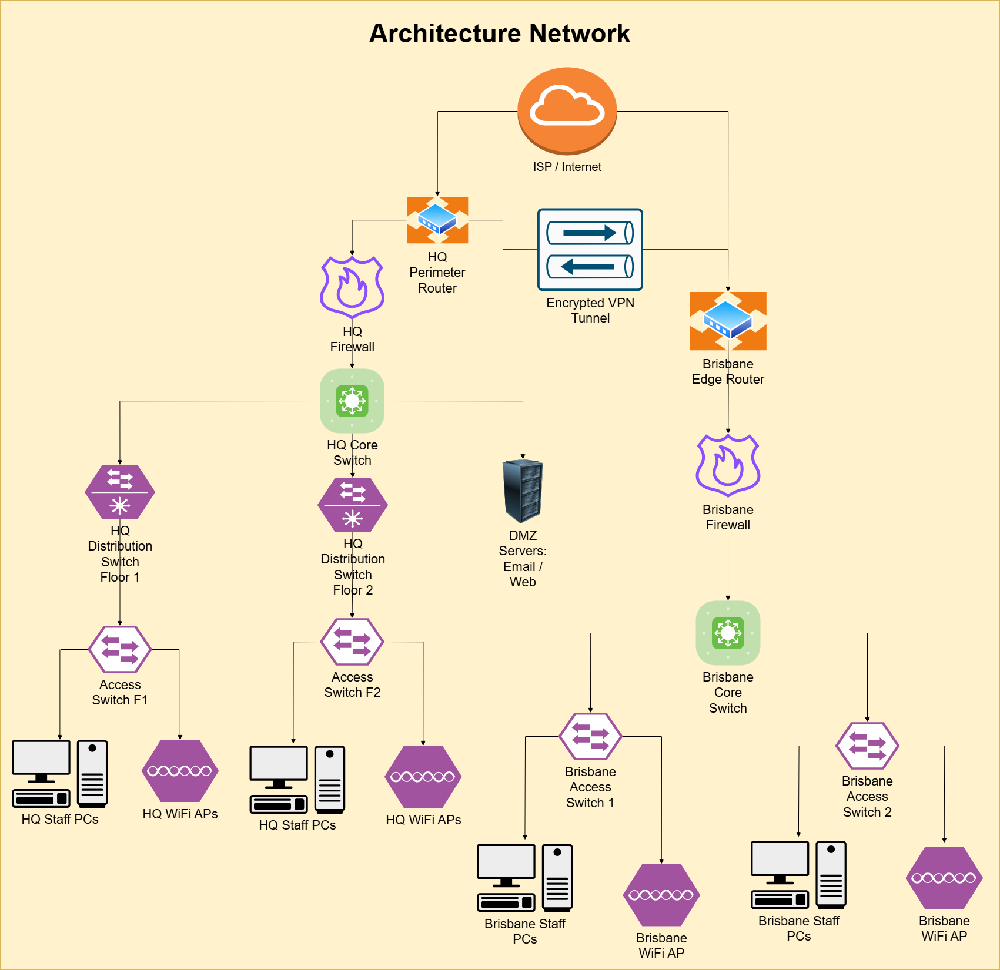
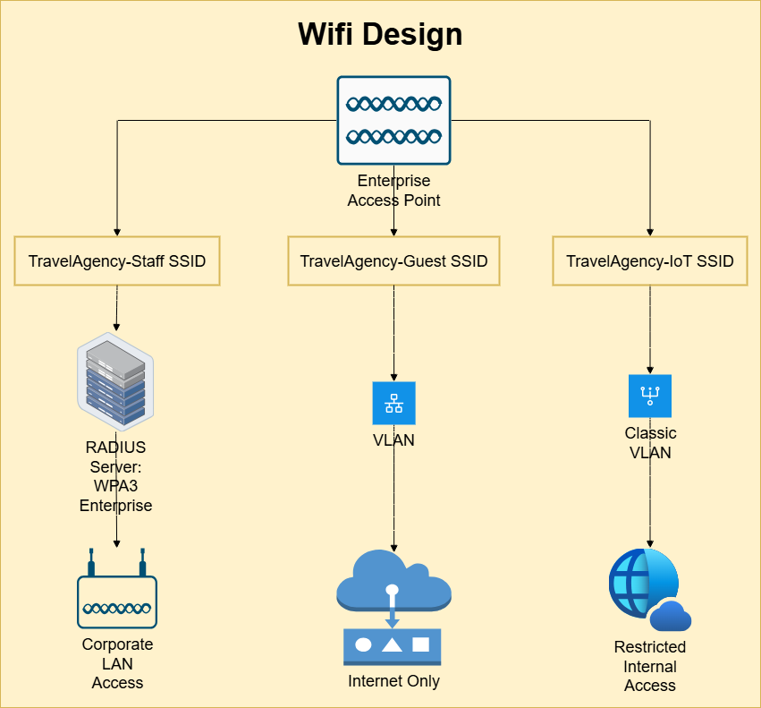

# 4.1.1 Network Planning and Design
This part outlines the proposed communication setup in detail.
| [Assumptions](#Presumptions) | [Network Architecture](#System-Layout) | [WiFi Design](#Wireless-Deployment) | [Address Allocations](#Address-Mapping) | [Recommended Equipment](#Hardware-Suggestions) | [Plan](./plan.md) | [Cloud Services](./cloud.md) | [Security](./security.md) | [Ethics](./ethics.md) | [Reflection](./reflection.md) | [Return to index](./README.md)

### Conceptual Layout
## Presumptions
Because the scenario lacks certain details, several practical assumptions were introduced to guide the architecture:
- **Main Headquarters**: Central administration and support teams are based in Melbourne, Australia.
- **Regional Offices**: Sydney, Brisbane, and Perth were selected as they represent key hubs for the international student travel sector.
- **Head Office Team**: Consists of consultants, IT engineers, payroll/HR officers, and senior executives.
- **Brisbane Staff**: Roughly 25 workers, including consultants and administrative helpers, will operate here.

These points establish the foundation for expected bandwidth use, equipment scale, wireless signal reach, and the ability to expand.

Furthermore, the framework must support secure VPNs for mobile staff, encrypted intra-office communication, VoIP calls, and cloud-based collaboration tools.

## Conceptual Layout and Rationale
**System Layout**
- Both the Melbourne HQ and Brisbane sites are designed using star topology, which improves fault isolation, simplifies upgrades, and increases resilience.
- In the HQ building, core distribution switches connect to floor-based distribution layers, which in turn connect to access switches. External connectivity is delivered by ISP links through perimeter routers and firewall systems. Wireless APs are evenly arranged across all levels.
- Email servers and the company web portal reside inside a demilitarised zone (DMZ).
- The Brisbane branch operates with a single edge router, firewall, one core switch, and two access switches. Encrypted VPN tunnels securely link it back to Melbourne.
- Subnetting is individually applied at each office to simplify routing and segment traffic efficiently.

### Major Design Considerations
  - Layout: Star configuration offers reliability, modular growth, and quick troubleshooting.
  - Defence: Security appliances ensure branch-to-HQ communication is filtered; DMZ separates external-facing systems.
  - Telework: VPN concentrators deliver protected remote connections.
  - Switching Strategy: Three-tier hierarchy (core, distribution, access) optimises performance and control.
  - Wireless Backbone: 10Gbps Cat6a cabling with enterprise-grade APs ensures high throughput.
  - Resilience: HQ central devices incorporate redundant power and alternate uplinks to reduce downtime.

This layered approach ensures flexibility, business continuity, and improved fault tolerance.

## Wireless Deployment
- Enterprise-grade WLAN is essential due to the organisation’s mobility and BYOD (bring your own device) initiatives.
- Placement: Ceiling APs deployed on every floor in Melbourne HQ and at the Brisbane branch.
- Supported Bands: Dual-frequency 2.4 GHz and 5 GHz, with tri-band capability.
- Capacity: Around 250 users per unit simultaneously.

Figure 2: Wireless distribution in the proposed infrastructure.

**SSID Configuration**:
- Agency-Staff: WPA3 Enterprise with centralised RADIUS verification.
- Agency-Visitors: WPA2 Pre-Shared Key, restricted guest-only access.
- Agency-IoT: WPA2 PSK, mapped to isolated VLAN.

- **Settings Applied**:
- Auto channel allocation with band steering enabled.
- Security: WPA3 Enterprise mandated for employees.
- Minimum threshold: –67 dBm signal strength.
- Fast roaming: 802.11r/k/v supported.
- Throughput: Each AP guarantees ≥ 300 Mbps baseline.

Guest network traffic is restricted to avoid unauthorised entry into private company data.

IP Scheme
- **Student Numbers: 12309018
- **Allocation Rule**: Final two digits define the first octet as “18”.
- **Subnet Size**: /24 blocks reserved for different segments (departments, servers, WLANs).

- **Address Mapping**:

| 18.10.0.0/24 → HQ LAN (Staff) |
| ----------------------------- |
| 18.10.1.0/24 → HQ Servers     |
| 18.10.2.0/24 → HQ Wireless    |
| 18.20.0.0/24 → Brisbane LAN   |
| 18.20.1.0/24 → Brisbane WiFi  |
| 18.30.0.0/24 → VPN Allocation |                     

## Hardware Suggestions

| Component       | Suggested Model / Specs                             | Approx. Cost (AUD) | Remarks                  |
| --------------- | --------------------------------------------------- | ------------------ | ------------------------ |
| HQ Firewall     | Fortinet FortiGate 80F, 10x GE, IDS/IPS, VPN        | ~1,500             | Enterprise-grade defense |
| Wireless Access | Ubiquiti UniFi 6 LR, WiFi 6, 300+ clients supported | ~320               | Strong dual-band support |
| HQ Core Switch  | Cisco CBS250-48T-4G, 48x GE + 4 SFP                 | ~800               | Serves as distribution   |
| Branch Router   | TP-Link ER7206, multi-WAN, VPN, load-balancing      | ~250               | Edge connectivity        |
| HQ Server       | Dell PowerEdge T550, Xeon Silver, 32GB RAM, 2TB HDD | ~3,500             | Hosting business apps    |

## References

Bibby, R. (2025). An Introductory Guide to Enterprise Network Design - NetBox Labs. [online] NetBox Labs. Available at: https://netboxlabs.com/blog/enterprise-network-design-guide/.

Buenning, M. (2022). How to Design a Network: 6 Best Practices for Success | NinjaOne. [online] www.ninjaone.com. Available at: https://www.ninjaone.com/blog/how-to-design-a-network-best-practices/.

